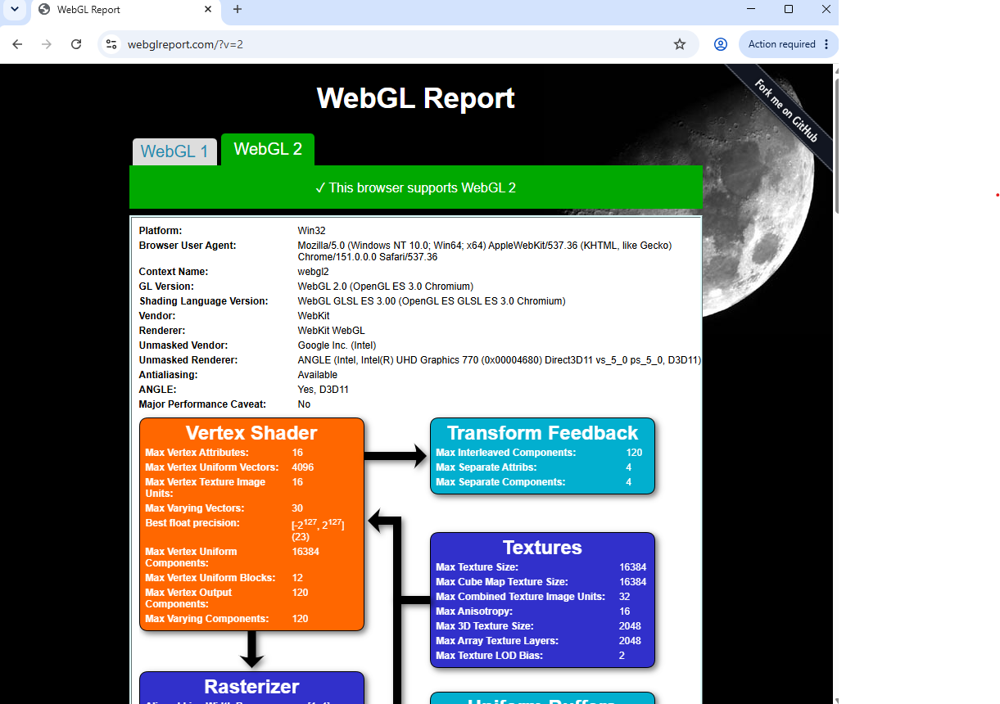
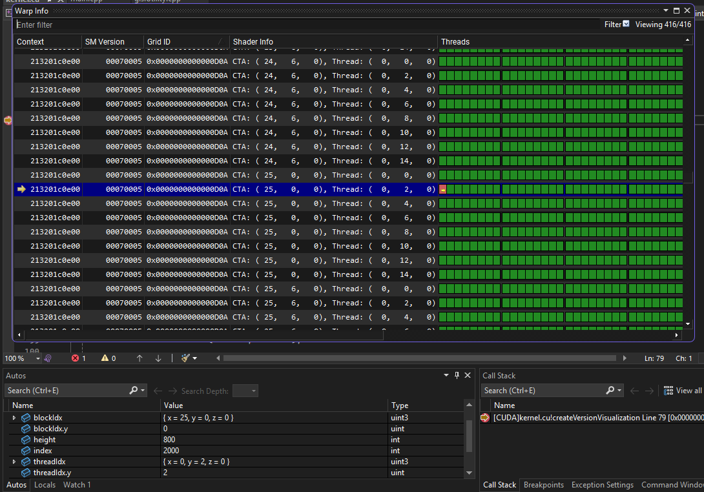

Project 0 Getting Started
====================

**University of Pennsylvania, CIS 5650: GPU Programming and Architecture, Project 0**

* Rayyan shik
  * [LinkedIn](https://www.linkedin.com/in/rayyan-shaik/)
* Tested on: Windows 22, i7-2222 @ 2.22GHz 22GB, GTX 222 222MB (Moore 2222 Lab)

### Overview

Note that I could not access Nsight Systems/Compute due to administrator access errors on the CETS virtual lab computers.

- Set up developer environment
 - 
 - 
 - 
- Profiled GPU warps
 - 

